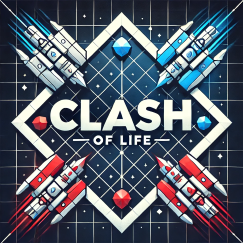

# Coding Weeks - Clash of Life

 

## Table des matières
- [Description](#Description_du_jeu_Clash_of_Life)
- [Règles du jeu](#règles_du_jeu)
- [Installation](#installation)                                                   
- [Lancement et Tutoriel](#Lancement)
- [Progression_MVP](#Progression_MVP)
- [Authors and acknowledgment](#Authors_and_acknowledgment)

## Description_du_jeu_Clash_of_Life

Ce jeu est une confrontation entre 2 joueurs sur une grille du jeu de la vie. Chacun a la possibilité d'envoyer des vaisseaux cellulaires vers l'adversaire, de construire des structures fixes (batiments) ou encore d'envoyer des sorts. 
Ils ont chacun l'objectif que leurs automates cellulaires atteignent le camp adverse, afin de diminuer la vie de l'opposant. 
Le premier ayant sa barre de vie nulle a perdu.
Cependant, les joueurs respectifs sont limités par une barre de mana, les empêchant d'invoquer des troupes à l'infini.  
Ce jeu repose alors sur une stratégie de gestion de ressource.

### Règles_du_jeu

Certaines modifications par rapport au jeu de la vie ont dues être implémenter: 
- **Les règles**
    - **Les cases en vie sont de 2 couleurs distinctes (rouge, bleue)**
    - **Une cellule morte possédant exactement trois voisines vivantes bleue (resp rouge) revêtie du bleu (resp du rouge).**
    - **Une cellule vivante bleue (resp rouge) possédant deux ou trois voisines vivantes bleus (resp rouge) le reste, sinon elle meurt.**
    - **La présence d'une cellule bleue(resp rouge) dans les voisins d'une cellule rouge (resp bleue) diminue de 1 le nombre de voisins effectifs.**
    - **Les cellules qui arrivent sur les cotés horizontaux sont automatiquements tués (alliés comme ennemies)**

## Installation
Cloner le dépot: 

    git clone https://gitlab-cw2.centralesupelec.fr/mathias.tan/clash-of-life.git

Installation des modules pygame, sys:

    pip install -r pygame

    pip install -r sys

## Lancement
Executer le fichier clash of life

    Sur Windows:

        py clash_of_life.py

    Sur MacOs: 

        python3 clash_of_life.py

# Tutoriel

- **Joueur_bleu** :
    - **Commandes deck de graines** :
        - `1, 2, 3, 4, 5`
    - **Commandes position invocation** :
        - `z`, `q`, `s`, `d`

- **Joueur_rouge** :
    - **Commandes deck de graines** :
        - `6, 7, 8, 9, 0`
    - **Commandes position invocation** :
        - `up`, `left`, `down`, `right`

## Progression_MVP

 
+ [**MVP** : accès à la progression_MVP de Clash of Life.](./Progression_MVP.md)

## Authors_and_acknowledgment
**Mathias Tan**, **Alexis Le Parco**, **Marwan Bakkouch**, **Hector Warzee**, **Thomas Spitz**

